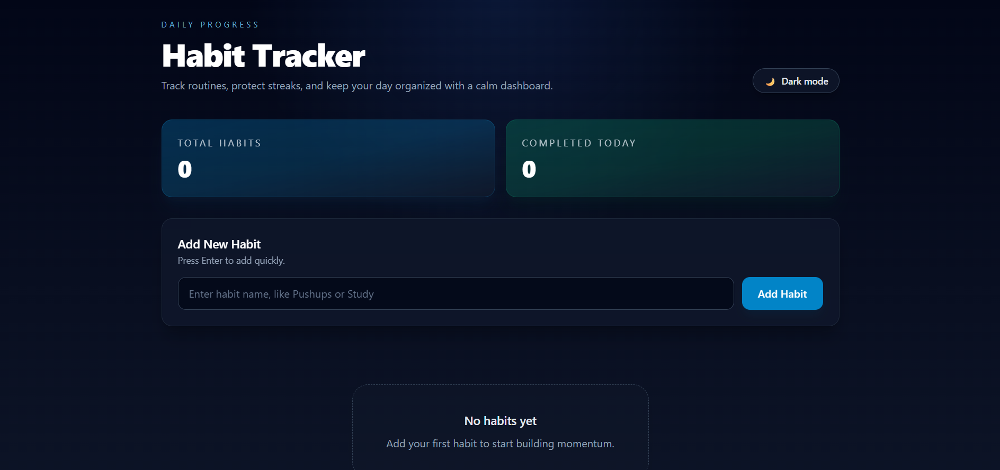

# HabitFlow – Smart Habit Tracker 🔥

A modern habit tracking web app built with HTML, Tailwind CSS, and JavaScript. It helps users track daily habits, maintain streaks, and stay consistent.

---

## 🚀 Features

* Add & delete habits
* Daily completion tracking
* Streak system (consecutive days logic)
* Completed Today indicators
* Dark/Light mode with persistence
* LocalStorage data saving
* Responsive UI with modern dashboard design

---

## 🛠️ Tech Stack

* HTML
* Tailwind CSS
* JavaScript (Vanilla)

---

## 🌐 Live Demo

https://habit-tracker-rho-inky.vercel.app/

---

## 📦 How to Run

1. Clone the repository
2. Open `index.html` in your browser

---

## 👤 Author

Thanusha
